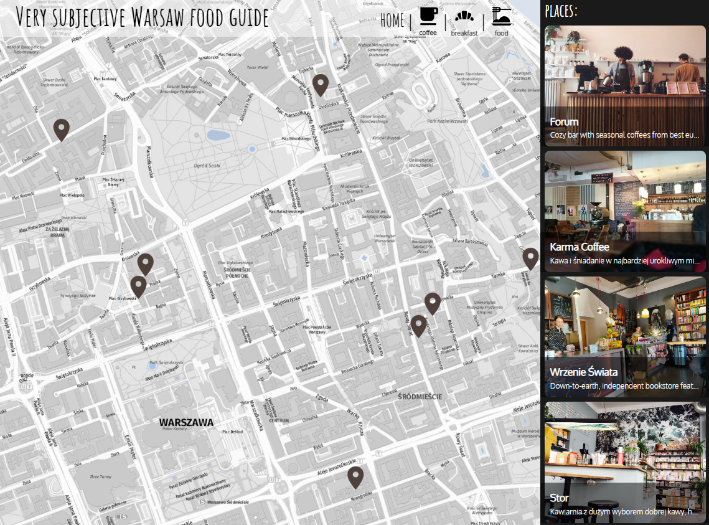

# 🗺️ DESCRIPTION
Very subjective guide (that are my recommendations for cozy places) to recommended coffees, breakfast places and restaurants in Warsaw.
Places can be searched on a map or on a slider. Map can be paned and zoomed.
You can sort places by type (coffees, breakfast,restaurants) by clicking on top menu. 
More details can be found after clicking on place name.
Enjoy.

# ▶️ DEMO
For demo click below:
https://subjective-warsaw-food-guide.web.app



# Technologies used
* React.js with Hooks,
* React Router Dom;
* React Easy Panzoom;
* Material UI;
* Node package manager;
* Sass,
* HTML,
* Firebase;

# 👌 FEATURES
* Responsive Web Design (RWD)
* Progressive Web Application (PWA)
* Mobile first
* Language version: ENG <sub> English is not my native language.
* Pan and zooming features added for map
* Material UI library for icons and tooltips used

# 🆔 LICENSE
MIT License

# ⏭️ NEXT STEPS
The project is still under construction - some additional places will be added soon.

# 😊 Download and Install
* Use the link from the 'Clone or download' button to download the project.
* In the project directory, type:
```bash
npm install
```
to install necessary dependencies.

* Run:
```bash
npm start
```
to start the app in the development mode.

* Open http://localhost:3000 to view it in the browser.


